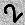

# Backpropagation

This is a simple implementation of backpropagation in Python. It is intended to be used as a learning tool, not as a production-ready neural network library.

Demo task: classify digits in the image.


## Requirements

* Python 3.6+

* Install `requirements.txt`
   ```bash
    pip install -r requirements.txt
    ```


## Backpropagation Implementation

See [`model.py`](./model.py) `__call__` method for the implementation of backpropagation.


## Usage

* `python train.py` to train a network on the digits recognition task. Model will be saved to `model.pkl` file.

* `python test.py` to test the network on the images in the [`./examples`](./examples) directory.


## Dataloader

- The [`dataloader`](./dataloader.py) module contains a class for randomly generating data for the digits recognition task.

- Each batch contain `batch_size` images of `shape` (25 x 25).

- The images are generated by randomly placing a digit from 0 to 9 on a 25 x 25 random noise image.

- The labels are vectors of length `batch_size`.


## Test Examples

<!-- 5 images in table -->
| [0.png](./examples/0.png) | [1.png](./examples/1.png) | [2.png](./examples/2.png) | [3.png](./examples/3.png) | [4.png](./examples/4.png) |
|:---:|:---:|:---:|:---:|:---:|
|  |  |  |  |  |

`python test.py` output:

```
loading model from: ./model.pkl
image: examples/0.png, prediction: [2]
image: examples/1.png, prediction: [6]
image: examples/2.png, prediction: [0]
image: examples/3.png, prediction: [7]
image: examples/4.png, prediction: [4]
```
